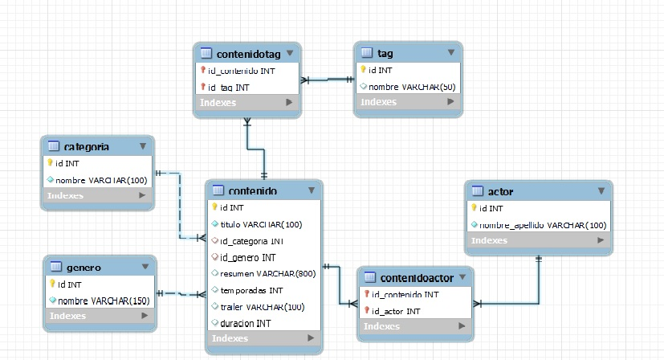

 # Nuestro Diseño del modelo de datos

    Nuestro proyecto es realizado con Node.js y MySQL, acompañado de una documentación adecuada.

 1. Comenzamos diseñando el modelo de datos. A continuación el diagrama diseñado incluyendo tablas intermedias para conectar algunas de estas tablas entre sí.

2. Luego se empezó agregar archivos correspondientes en visual studio code sumado a las instalaciones necesarios para inicializar el proyecto:

        npm i sequelize mysql2 dotenv express

3. Agregamos los endpoints para la funcionalidad.